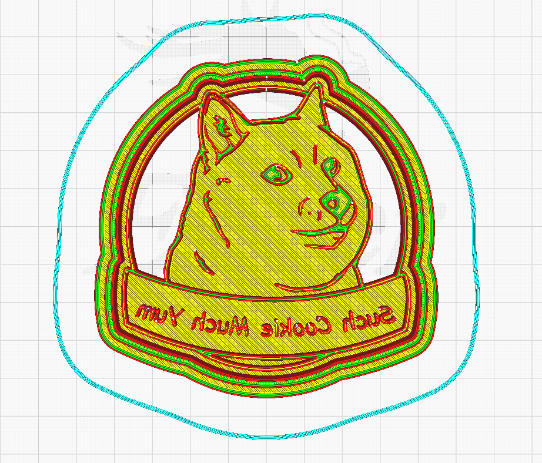

# Fusion360-CookieCutter-Automation
3D design automation of acookie cutter in Fusion 360 for 3D printing. Based on PyAutoGUI library that lets you control mouse and keyboard to automate interactions, in this case the code automates the 3D design of a cookie cutter from an .svg file (vector). PyAutoGUI uses X and Y coordinates (may vary from PC) to control mouse position, to know the position there is a Mouse Position.py file.

## Preview


## Installation
- Install PyAutoGUI for the mouse and keyboard interactions.
```
pip install pyautogui
```